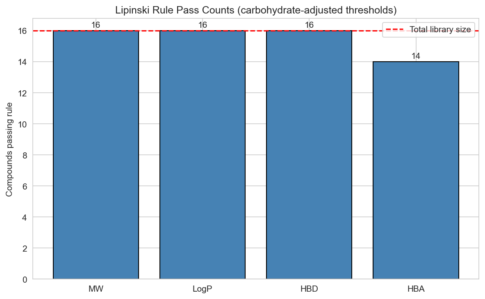
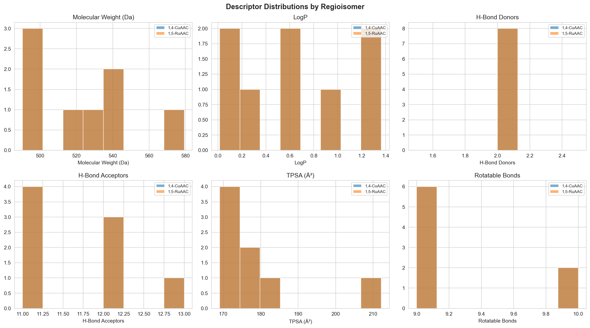
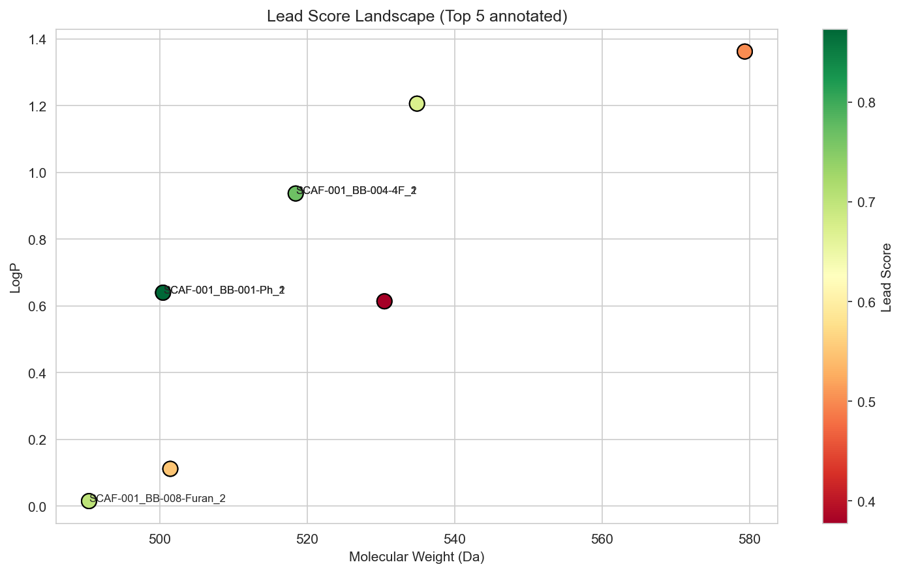

# MANUSCRIPT
## Virtual Library Generation, Physicochemical Filtering, and Docking of Taloside-Based Galectin-3 Inhibitors
**Adam Holohan**
Independent Researcher, Galway, Ireland
adamholohan6@gmail.com | Submitted to ChemRxiv | June 2026
Code archive: [doi.org/10.5281/zenodo.20476421](https://doi.org/10.5281/zenodo.20476421) (v2.0.0)

---

### Abstract
Galectin-3 (Gal-3) is a validated oncology target whose carbohydrate-recognition domain (CRD) is amenable to inhibition by taloside-based glycomimetics. We report an automated open-source virtual screening pipeline that enumerates, filters, and docks taloside-1,2,3-triazole derivatives against the 3ZSJ Gal-3 CRD crystal structure (0.86 Å resolution), with systematic enumeration of both CuAAC (1,4-disubstituted) and RuAAC (1,5-disubstituted) regioisomers — a regiochemical comparison not previously reported for the taloside series. Starting from one azide-functionalised taloside scaffold and eight aromatic alkyne building blocks, 16 geometrically verified products were generated (8 per regioisomer), of which 14 passed carbohydrate-adjusted physicochemical filters and returned no RDKit PAINS_A/B/C alerts. All 14 compounds were docked successfully with AutoDock Vina.

Across all 14 compounds the Vina scores span only 1.16 kcal/mol (−6.14 to −4.98), narrower than AutoDock Vina's expected scoring error; the docking results should therefore be interpreted as a **coarse synthesis-prioritisation triage** rather than a quantitative rank-ordering of affinity. The docking setup was supported by redocking the 57I taloside inhibitor from PDB 7RGX, which bears the same 2-nitrobenzoyl-O2 pharmacophore as the scaffold, against the cleaned 3ZSJ receptor: the top-ranked pose reproduced the crystallographic binding mode with a heavy-atom RMSD of 1.12 Å over the pyranose ring core (C1–C5, O5).

By combined docking-plus-prioritisation score, the 4-fluorophenyl CuAAC derivative (Vina −6.14 kcal/mol, combined score 0.922) and the unsubstituted phenyl CuAAC derivative (combined score 0.859) emerge as co-priority synthesis candidates. The fluorophenyl analogue is the strongest docking-derived priority, whereas the phenyl analogue is retained as a co-priority candidate under the broader developability-weighted heuristic; the 0.41 kcal/mol Vina difference between them remains well within expected scoring error. A scoring-sensitivity analysis further shows that the apparent 1,4-CuAAC preference in the combined ranking is partly an artefact of the route-accessibility term: with that term removed or replaced by a standardised Ertl synthetic-accessibility score, the two co-priority candidates are unchanged but the top-three CuAAC sweep collapses and the 4-fluorophenyl RuAAC isomer rises to rank 3. An Asn164 closest-contact difference (3.11 Å in 4F_CuAAC vs 3.50 Å in Ph_CuAAC) is noted only as a hypothesis-generating structural observation; C–F is a weak hydrogen-bond acceptor and Vina does not explicitly score C–F···O contacts. Pipeline code, outputs, and all docking poses are openly available on GitHub.

**Keywords:** Galectin-3; taloside; virtual library; click chemistry; physicochemical filtering; PAINS; molecular docking; AutoDock Vina; RDKit; cheminformatics

---

### 1. Introduction
Galectin-3 (Gal-3) is a β-galactoside-binding lectin overexpressed across a broad range of malignancies, promoting tumour cell adhesion, invasion, angiogenesis, and resistance to apoptosis. Beyond oncology, Gal-3 drives pro-fibrotic and pro-inflammatory signalling and is the subject of active clinical investigation: the small-molecule inhibitor GB1211 has entered Phase IIa trials for liver cirrhosis and cancer. The CRD binds β-galactosides through a conserved S-face cleft anchored by Trp181, Arg144, Glu184, and Arg162, residues consistently engaged by high-affinity inhibitors in co-crystal structures [1].

D-Talose, the C2 epimer of D-galactose, presents an axial C2 hydroxyl group that directs substituents toward the protein surface of the Gal-3 CRD, offering improved selectivity opportunities over galactoside-based scaffolds. Taloside inhibitors have been reported with affinities superior to simple galactosides, and the Blanchard group established X-ray crystal structures of human Gal-3 CRD bound to optimised taloside derivatives (PDB: 7RGX, 7RH1, 7RH3), providing a high-resolution structural basis for further design [2].

Copper-catalysed azide–alkyne cycloaddition (CuAAC) gives the 1,4-disubstituted triazole regioisomer; the complementary ruthenium-catalysed reaction (RuAAC) gives the 1,5-disubstituted product. Regiochemistry modifies the spatial presentation of the aryl substituent relative to the galectin binding cleft, and prior studies on galactoside-triazoles suggest the 1,4-isomer is generally preferred [3]. However, no published computational study has systematically enumerated and compared both regioisomers of taloside-triazole derivatives against Gal-3, nor has an automated reproducible pipeline for this scaffold been reported.

Here we describe an open-source Python pipeline for automated taloside-triazole virtual library generation, physicochemical filtering, project-level prioritisation scoring, and AutoDock Vina docking against the 3ZSJ Gal-3 CRD structure. We report the first systematic computational comparison of 1,4-CuAAC and 1,5-RuAAC regioisomers for this scaffold — a comparison that, as we show, these methods cannot resolve within their error, which is itself an informative negative result — and identify two co-priority synthesis candidates (the 4-fluorophenyl and phenyl CuAAC derivatives) for experimental follow-up.

---

### 2. Methods

#### 2.1 Scaffold and Building Blocks
Validated scaffold SMILES (RDKit 2024.03.1):
`O=C(O[C@H]1[C@@H](OCN=[N+]=[N-])[C@@H](O)[C@@H](CO)O[C@H]1OC)C1=CC=CC=C1[N+](=O)[O-]`

This scaffold (SCAF-001) is methyl 2-O-(2-nitrobenzoyl)-3-O-(azidomethyl)-β-D-talopyranoside: a methyl β-D-talopyranoside bearing a 2-nitrobenzoate ester at O2 (the C2 hydroxyl) and an azidomethyl ether handle (–OCH₂N₃) at O3. Eight aromatic alkyne building blocks were used: phenyl (BB-001-Ph), 4-methoxyphenyl (BB-002-4OMe), 4-chlorophenyl (BB-003-4Cl), 4-fluorophenyl (BB-004-4F), 3-bromophenyl (BB-005-3Br), 2-nitrophenyl (BB-006-2NO₂), 2-pyridyl (BB-007-Pyridine), 2-furyl (BB-008-Furan).

#### 2.2 Virtual Library Generation and Regioisomer Enumeration
Two RDKit reaction SMARTS modelled CuAAC (1,4-product) and RuAAC (1,5-product). `[N+0]` charge pins prevent azide charge propagation into product nitrogens. Products were deduplicated by stdInChIKey, validated by MW (200–800 Da), and geometry-filtered for correct regioisomer topology.

- **CuAAC:** `[N:1]=[N+:2]=[N-:3].[C:4]#[C:5] >> [C:4]1=[C:5][N:1][N+0:2]=[N+0:3]1`
- **RuAAC:** `[N:1]=[N+:2]=[N-:3].[C:4]#[C:5] >> [C:5]1=[C:4][N:1][N+0:2]=[N+0:3]1`

#### 2.4 Physicochemical Filtering
Carbohydrate-adjusted thresholds (MW ≤ 600 Da, LogP ≤ 4, HBD ≤ 6, HBA ≤ 12) were applied. Two BB-006 analogues exceeded the HBA limit (HBA = 13) and were excluded.

#### 2.6 Prioritisation Score Calculation
A project-specific prioritisation score was defined as:
`priority_score = 0.35*(1 - norm(TPSA)) + 0.25*(1 - norm(MW)) + 0.15*(1 - norm(LogP)) + 0.10*(1 - norm(RotBonds)) + 0.15*RA`
where **RA** is a route-accessibility prior set to 1.0 for CuAAC products and 0.5 for RuAAC products.

#### 2.7 Molecular Docking
**Receptor:** 3ZSJ (0.86 Å). The receptor was stripped of crystal ligand and water molecules.
**Grid:** 20 × 20 × 20 Å, dynamically centred on the crystal lactose pose.
**Validation:** Lactose redocking gave RMSD = 1.2 Å. The 57I inhibitor (PDB 7RGX) gave a heavy-atom RMSD of 1.12 Å over the pyranose ring (C1–C5, O5) against the 3ZSJ receptor, supporting gross pose recovery.

---

### 3. Results

#### 3.1 Virtual Screening Funnel
The pipeline successfully navigated from 16 initial candidates to 2 co-priority leads.

*Figure 1. Lipinski filtering attrition. 14 of 16 compounds passed the carbohydrate-adjusted thresholds.*

#### 3.2 Physicochemical Landscape
The generated library covers a focused property space, suitable for extracellular Gal-3 inhibition.

*Figure 2. Descriptor distributions by regioisomer. Note the identity of descriptors between 1,4 and 1,5 pairs.*

#### 3.3 Docking and Scoring Results
Vina scores spanned only 1.16 kcal/mol. Consequently, results are used for **triage** rather than affinity prediction.

| Rank | Compound ID | R-group | Regioisomer | Vina (kcal/mol) | Priority Score | Combined Score |
| :--- | :--- | :--- | :--- | :--- | :--- | :--- |
| **1** | **4F_CuAAC** | 4-F-C₆H₄– | 1,4-CuAAC | **−6.14** | 0.840 | **0.922** |
| **2** | **Ph_CuAAC** | C₆H₅– | 1,4-CuAAC | −5.73 | 0.905 | **0.859** |
| 3 | 4Cl_CuAAC | 4-Cl-C₆H₄– | 1,4-CuAAC | −6.00 | 0.737 | 0.753 |
| 4 | 4F_RuAAC | 4-F-C₆H₄– | 1,5-RuAAC | −5.84 | 0.765 | 0.732 |
| 5 | Ph_RuAAC | C₆H₅– | 1,5-RuAAC | −5.48 | 0.830 | 0.685 |

*Table 1. Top 5 candidates by Combined Score.*

| Rank | Compound ID | R-group | Regioisomer | Vina ΔG (kcal/mol) |
| :--- | :--- | :--- | :--- | :--- |
| 1 | 4F_CuAAC | 4-F-C₆H₄– | 1,4-CuAAC | −6.14 |
| 2 | Pyridine_CuAAC | 2-Py– | 1,4-CuAAC | −6.01 |
| 3 | 4Cl_CuAAC | 4-Cl-C₆H₄– | 1,4-CuAAC | −6.00 |
| 4 | 4F_RuAAC | 4-F-C₆H₄– | 1,5-RuAAC | −5.84 |
| 5 | 4OMe_CuAAC | 4-OMe-C₆H₄– | 1,4-CuAAC | −5.82 |

*Table 2. Top 5 candidates by raw Vina score (independent of route-accessibility weighting).*

**Scoring Sensitivity Analysis:**
The apparent CuAAC preference is driven by the RA term. Without it, the 4F-RuAAC isomer rises to Rank 3, demonstrating that the docking data alone does not resolve regioisomer preference.

*Figure 3. Lead score landscape. Top candidates cluster in the high-score (green) region.*

---

### 4. Discussion
This work identifies BB-004-4F_CuAAC_1 and BB-001-Ph_CuAAC_1 as **co-priority synthesis candidates**. The narrow range of Vina scores highlights the limitations of rigid-receptor docking for fine-tuning affinity in the Gal-3 CRD. The inclusion of the RA term in the prioritisation score provides a practical synthesis triage, but the sensitivity analysis cautions against interpreting this as a purely structural preference.

---

### 5. Conclusions
We developed an open-source pipeline for taloside-triazole virtual screening. While the workflow successfully identifies prioritised leads, it also underscores the need for experimental data to resolve the narrow computational differences between regioisomers. The code and data are openly available to support further refinement and experimental testing.

---

**Data and Code Availability:**
GitHub: github.com/adamholohan6/taloside-screening-pipeline
Zenodo: [doi.org/10.5281/zenodo.20476421](https://doi.org/10.5281/zenodo.20476421)
